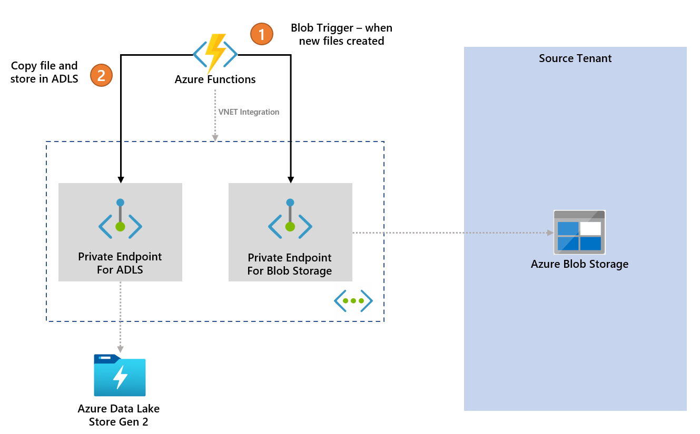
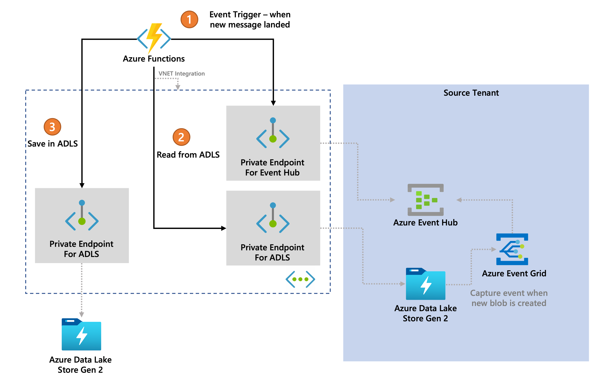

# Sample code for Azure Functions - cross tenant blob to ADLS file replication
This repository contains sample code for Azure Functions to replicate file between 2 Azure tenants. Full details here in medium post: [How to use Azure Private Link for Secured Cross Tenant Data Replication Near Real Time](https://marcustee.medium.com/how-to-use-azure-private-link-for-secured-cross-tenant-data-replication-near-real-time-963de887bdc5)

## Details
This function monitor files created in **SOURCE_BLOB_CONTAINER** folder in blob storage. Update the apps configuration accordingly.

```csharp
        public async Task Run(
            [BlobTrigger("%SOURCE_BLOB_CONTAINER%/{name}",  //update the monitored resource accordingly
            Connection = "SOURCE_BLOB_CONNECTION_STRING")]Stream myBlob, 
            string name, 
            ILogger log)
```

For development locally, rename the file _sample.local.settings.json_ to _local.settings.json_.

### Authentication
The data source in this case, is Azure Blob Storage, and the destination is Azure Data Lake Store Gen 2.

This Azure Functions runs in destination tenant, hence not able to use managed identity to authenticate to blob storage in source tenant. Connection string is used instead. Update the _local.settings.json_ accordingly, or application settings once deployed. For security purposes, Azure Key Vault can be used to protect connection string of blob storage.

On the other hand, since Azure Functions and ADLS Gen 2 are running in the same tenant, managed identity can be used for authentication. Enable managed identity in Azure Functions and update ADLS access control list (ACL) accordingly.

### Apps Configuration (Environment Variables)

|Name | Description | Remarks|
|---|---|---|
|SOURCE_BLOB_CONTAINER|Name of the Azure Blob Storage container name to monitor| Mandatory|
|SOURCE_BLOB_CONNECTION_STRING|Full connection string to Azure storage using access key| Mandatory|
|DEST_ACCOUNT_NAME| Name of the destination of Azure Data Lake Storage Gen 2|Mandatory|
|DEST_ACCOUNT_KEY| Account key for destination Azure Data Lake Storage Gen 2. Required if key is used for authentication| Optional| 
|DEST_CONTAINER| Container name of destination Azure Data Lake Storage Gen 2|Mandatory|
|DEST_DIRECTORY|Directory within the container of destination Azure Data Lake Storage Gen 2 above|Mandatory|
|USE_EVENT_HUB|Option to use Azure Event Hub as logging on the status of replication. Accept "TRUE" or "FALSE".|Optional|
|EVENT_HUB_NAME| Name of the event hub created inside Azure Event Hub namespace|Optional, required if **USE_EVENT_HUB** is set to "TRUE"|
|EVENT_HUB_CONNECTION_STRING|Connection string of event hub. Required if connection string is used for authentication. Without connection string, Azure Functions will use Managed Identity to authenticate|Optional, needed if key is used for authentication|
|EVENT_HUB_NAMESPACE_NAME| Name of the Azure Event Hub Namespace| Optional, needed if managed identity is used for authentication|

### Architecture


## Variation
This repository also provides another option, where the data source is also Azure Data Lake Storage Gen 2, and the destination is also Azure Data Lake Storage Gen 2, but both are in different tenant.

Azure Functions blob trigger is only for Azure Storage, hence we need to tweak the option. The function used is called __EventHubTrigger.cs__, which the name suggested, uses Azure Event Hub to trigger instead.

In this cross tenant scenario, the trigger is Azure Event Hub. Azure Event Hub supports using Managed Identity for authentication, but in this cross tenant scenario, it is not supported, hence we need to use connection string to authenticate. To ingest event into this Event Hub, we can take advantage of Azure Event Grid, but forwarding the signal to Event Hub whenever new blob is created.

### Apps Configuration (Environment Variables)

|Name | Description | Remarks|
|---|---|---|
|TRIGGER_EVENT_HUB_NAME|Name of the event hub that contains message/event injected from Azure Event Grid| Mandatory|
|TRIGGER_EVENT_HUB_CONNECTION|Connection string of the event hub capturing events when new file is created| Mandatory|
|SOURCE_ACCOUNT_NAME| Name of the source of Azure Data Lake Storage Gen 2|Mandatory|
|SOURCE_ACCOUNT_KEY| Account key for source Azure Data Lake Storage Gen 2. Required if key is used for authentication| Mandatory| 
|SOURCE_CONTAINER| Container name of source Azure Data Lake Storage Gen 2|Mandatory|
|DEST_ACCOUNT_NAME| Name of the destination of Azure Data Lake Storage Gen 2|Mandatory|
|DEST_ACCOUNT_KEY| Account key for destination Azure Data Lake Storage Gen 2. Required if key is used for authentication| Optional| 
|DEST_CONTAINER| Container name of destination Azure Data Lake Storage Gen 2|Mandatory|
|DEST_DIRECTORY|Directory within the container of destination Azure Data Lake Storage Gen 2 above|Mandatory|
|USE_EVENT_HUB|Option to use Azure Event Hub as logging on the status of replication. Accept "TRUE" or "FALSE".|Optional|
|EVENT_HUB_NAME| Name of the event hub created inside Azure Event Hub namespace|Optional, required if **USE_EVENT_HUB** is set to "TRUE"|
|EVENT_HUB_CONNECTION_STRING|Connection string of event hub. Required if connection string is used for authentication. Without connection string, Azure Functions will use Managed Identity to authenticate|Optional, needed if key is used for authentication|
|EVENT_HUB_NAMESPACE_NAME| Name of the Azure Event Hub Namespace| Optional, needed if managed identity is used for authentication|

### Architecture
